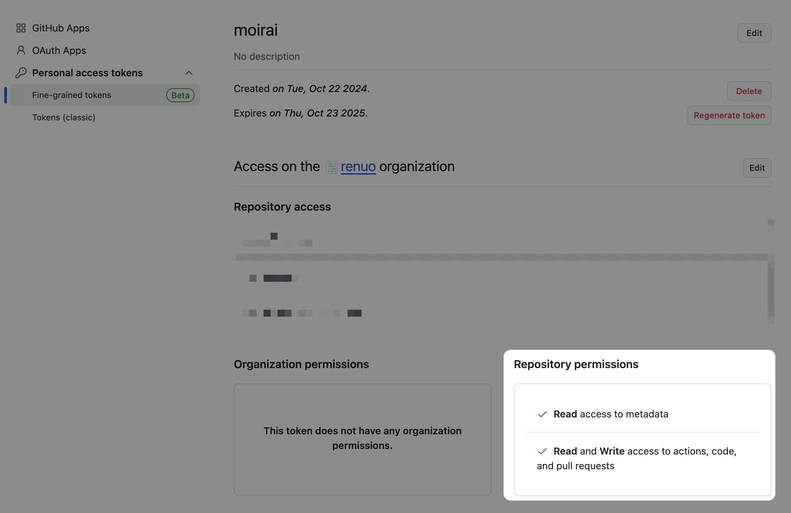

# 🧵 Moirai


### Manage translation strings in real time

- Let your non-developer team members finally manage translations (yes, even Karen from marketing...).
- See those translations live in your app, so you can make sure “Submit” isn’t overlapping the button where “**Do not
  press this button EVER” should be.
- Automatically create Pull Requests based on these changes, saving your developers from yet another “small tweak” email
  request.

> Let the world be translated, one typo at a time.

## Installation

Add this line to your application's Gemfile:

```ruby
gem "moirai"
```

And then execute:

```bash
bundle
```

Next, you need to run the generator which will create the necessary files including the database migration,
as well as inserting the engine in the `routes.rb` file, and importing the necessary javascript files:

```bash
bin/rails g moirai:install
```

Then run:

```bash
bin/rails db:migrate
```

## Usage

### Mount path

By default, Moirai is mounted under `/moirai`. You can change it by specifying the `root_path` option in `config/initializers/moirai.rb`:

```ruby
# config/initializers/moirai.rb
config.root_path = "/my_translations"
```

### How to change translations

If you mounted Moirai under "/moirai", head there and you will find a list of all the files containing texts that can be
translated.
Open a file, change the value of translations, and press ENTER to update the translation and see it immediately changed
on the application.

### Inline editing

By default, inline editing is disabled. To enable it, specify the following in `application.rb`:

```ruby
config.moirai.enable_inline_editing = ->(params:) { params[:moirai] == "true" }
```

If you set `moirai=true` query parameter in the URL, inline editing will appear in your page.

You probably want to only allow specific users to perform inline editing, this is an example of how you can do it:

```ruby
config.moirai.enable_inline_editing = ->(params:) { (params[:moirai] == "true") && current_user&.admin? }
```

You also need to have the moirai_translations_controller.js Stimulus Controller initialized. Read below how to:

#### Importmap

The command `bin/rails g moirai:install` should have already pinned the necessary controller for you in importmap.rb, so
no further steps are needed.

#### jsbulding

The command `bin/rails g moirai:install` should have already copied the necessary controller for you in
`app/javascripts/controllers`, so no further steps are needed.

#### More?

If you’re unsure about all the possible configuration options, you can simply copy and paste the stimulus controller
into your app as a fallback.

### Automatic PR creation with Octokit (**optional**)

If you would like Moirai to automatically create a pull request on GitHub to keep translations synchronized with the
codebase,
you need to set up [Octokit](https://github.com/octokit/octokit.rb).
You will also need to create a **Personal Access Token** on GitHub, and configure the access in the appropriate *
*environment variables** (this is explained below).

#### 1. Add Octokit to Your Gemfile

First, add Octokit to your project’s Gemfile:

```
gem "octokit"
```

Then run `bundle install`.

#### 2. Create a Personal Access Token (PAT) on GitHub

You will need a Personal Access Token (PAT) with the `Content - Write` permission to allow Octokit to create branches
and pull requests.

- Go to [GitHub Token Settings](https://github.com/settings/personal-access-tokens/).
- Click Generate New Token in Fine Grained Tokens.
- Give your token a name (e.g., "moirai").
- Under Repository Permissions, select:
    - Actions - Read/Write
    - Contents - Read/Write
    - Pull Request - Read/Write
- Generate the token and copy it immediately as it will be shown only once.

#### 3. Set Up Environment Variables

You need to configure the following environment variables in your application:

- `MOIRAI_GITHUB_REPO_NAME`: The name of the repository where the pull request will be created.
- `MOIRAI_GITHUB_ACCESS_TOKEN`: The Personal Access Token (PAT) you created earlier.

For example, in your `.env` file:

```env
MOIRAI_GITHUB_REPO_NAME=your-organization/your-repo
MOIRAI_GITHUB_ACCESS_TOKEN=your-generated-token
```

We also support Rails credentials. The environment variables need to be stored in a slightly different way to adhere to
convention. For example:

```env
moirai:
  github_repo_name: your-organization/your-repo
  github_access_token: your-generated-token
```

#### 4. Triggering the pull request creation

Moirai will now be able to use this Personal Access Token to create a pull request on GitHub when a translation is
updated.

To trigger this, you can press the `Create or update PR` button once you have made your changes.

### Authentication

Moirai allows you to use basic HTTP authentication to protect the engine.
To enable this, you need to set the following environment variables:

```env
MOIRAI_BASICAUTH_NAME=moirai
MOIRAI_BASICAUTH_PASSWORD=moirai
```

> ⚠️ Remember to protect Moirai. You don't want to give everyone the possibility to change strings in the application.

If you have authenticated users, you can leverage the Rails Routes protection mechanism to protect the engine.
See the following example:

```ruby
authenticated :user, lambda { |u| u.role == "admin" } do
  mount Moirai::Engine => "/moirai", as: "moirai"
end
```

## Development

1. Check out the repo:
    ```bash
    git clone git@github.com:renuo/moirai.git
    cd moirai
    ```

2. Run the setup script to install dependencies and prepare the env variables:
    ```bash
    bin/setup
    ```
   
3. Set your environment variables using the newly created `.env` file.

You will need a repository to test against and a token. Generate a new Fine-GRained Personal access token and give the
necessary permissions to your repository.
See the image below as an example:



5. Run the tests:
    ```bash
    bin/check
    ```

6. To view the engine in a dummy app:
    ```bash
    bin/rails s
    ```

## TODO

* Support for HTML
* Support for interpolation
* Support for count variants
* Better inline editing tool
* Support for fallbacks: it should detect when a fallback string is in use and prevent attempts to override its value.

## License

The gem is available as open source under the terms of the [MIT License](https://opensource.org/licenses/MIT).

## Copyright

Copyright [Renuo AG](https://www.renuo.ch/).
